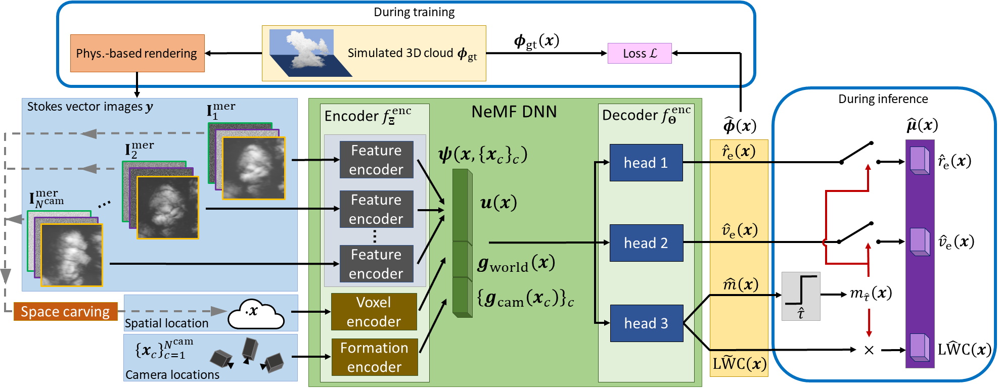

# NeMF: Neural Microphysics Fields
[](https://ieeexplore.ieee.org/document/10700962)


## Abstract
Inverse problems in scientific imaging often seek physical characterization of heterogeneous scene materials. The scene is thus represented by physical quantities, such as the density and sizes of particles (microphysics) across a domain. Moreover, the forward image formation model is physical. An important case is that of clouds, where microphysics in three dimensions (3D) dictate the cloud dynamics, lifetime and albedo, with implication to Earths' energy balance, solar power generation and precipitation. Current methods, however, recover very degenerate representations of microphysics. To enable 3D volumetric recovery of all the required microphysical parameters, we present neural microphysics fields (NeMF). It is based on a deep neural network, whose input is multi-view polarization images. For fast inference, it is pre-trained  through supervised learning. Training relies on polarized radiative transfer, and noise modeling in polarization-sensitive sensors. The results offer unprecedented recovery, including of droplet effective variance. We test NeMF in rigorous simulations and demonstrate it using real-world polarization-image data.



## Description
This repository contains the official implementation of NeMF: Neural Microphysics Fields, accepted for publication in IEEE Transactions on Pattern Analysis and Machine Intelligence, and presented at ICCP 2024.
Our framework preforms fast scattering tomography of clouds for variable viewing
geometries and resolutions. NeMF is a full-pipeline system containing a forward-model simulation for generating multi-view polarization cloud imaes and a neural network solving the tomography problem. NeMF's decoder consists of 3 heads. Each of the heads assigns an estimated value of a cloud's microphysical parameters at a queried location: the cloud's effective radius, effective variance and liquid water content. 
The decoder's input is a feature vector. It consists of 3 concatenated feature vectors of 3 encoders: The first is a feature vector expressing the 3D geometry of the queried location. 
The second expresses the geometry of the viewpoint (camera) locations. The third is a vector of image
features, associated with the queried location.  For more details see our [paper](https://ieeexplore.ieee.org/stamp/stamp.jsp?tp=&arnumber=10700962) and [supplementary material](https://ieeexplore.ieee.org/ielx8/34/4359286/10700962/supp1-3467913.pdf?arnumber=10700962).

&nbsp;

## Installation
Installation using using anaconda package management

Start a clean virtual environment
```
conda create -n NeMF python=3.8
source activate NeMF
```

Install required packages
```
pip install -r requirements.txt
```

&nbsp;

## Usage

### Data
We used cloud field data that was generated by Eshkol Eytan (see citation below).
You can download the simulated cloud data and real-world AirMSPI files [here](https://technionmail-my.sharepoint.com/personal/hybridlab_technion_ac_il/_layouts/15/onedrive.aspx?id=%2Fpersonal%2Fhybridlab%5Ftechnion%5Fac%5Fil%2FDocuments%2FInbal%20ICCP24&ga=1).
Change the 'data_root' parameter to your current data path in '/NeMF/microphysics_dataset.py' and 'DEFAULT_DATA_ROOT' in '/NeMF/microphysics_airmspi_dataset.py'. 
&nbsp;

### Trained NeMF models
The VIP-CT trained models can be found [here]([https://technionmail-my.sharepoint.com/:f:/g/personal/roironen_campus_technion_ac_il/ErkbzbuTr4NDnhrumeJDVLEBbAihvTYP5mwvkWUu_GuBLQ?e=QbEOXS](https://technionmail-my.sharepoint.com/personal/hybridlab_technion_ac_il/_layouts/15/onedrive.aspx?id=%2Fpersonal%2Fhybridlab%5Ftechnion%5Fac%5Fil%2FDocuments%2FInbal%20ICCP24&ga=1).

&nbsp;
### Simulations
#### Training 
Set the config file at configs/microphysics_train.yaml according to the desired experiment, e.g. dataset_name: "BOMEX_500CCN_10cams_20m_polarization_pyshdom"/"CASS_10cams_20m_polarization_pyshdom" etc.
Then, run


```
python NeMF/train_NeMF.py
```

#### Evaluation 
Set the config file at configs/microphysics_test.yaml according to the desired experiment and trained model path.
Then, run

```
python NeMF/test_NeMF.py
```
&nbsp;

### AirMSPI
#### Training 
Set the config file at configs/microphysics_train_airmspi.yaml according to the desired experiment, e.g. drop_index: 2 etc.
Then, run


```
python NeMF/train_NeMF_AirMSPI.py
```

#### Evaluation 
Set the config file at configs/microphysics_test_airmspi.yaml according to the desired experiment and trained model path. 
Then, run

```
python NeMF/test_NeMF_AirMSPI.py
```


&nbsp;


## Citation
If you make use of our work, please cite our paper:
```
@article{kombetzer2024nemf,
  author={Kom Betzer, Inbal and Ronen, Roi and Holodovsky, Vadim and Schechner, Yoav Y. and Koren, Ilan},
  journal={IEEE Transactions on Pattern Analysis and Machine Intelligence}, 
  title={Ne{MF}: Neural Microphysics Fields}, 
  year={2024},
  publisher={IEEE}
}
```
Thanks to Eshkol Eytan for the cloud simulation data. If you use it please cite:
```
@article{eytan2021revisiting,
  title={Revisiting adiabatic fraction estimations in cumulus clouds: high-resolution simulations with a passive tracer},
  author={Eytan, Eshkol and Koren, Ilan and Altaratz, Orit and Pinsky, Mark and Khain, Alexander},
  journal={Atmospheric Chemistry and Physics},
  volume={21},
  number={21},
  pages={16203--16217},
  year={2021},
  publisher={Copernicus GmbH}
}
```

If you use this package in an academic publication please acknowledge the appropriate publications (see LICENSE file). 
